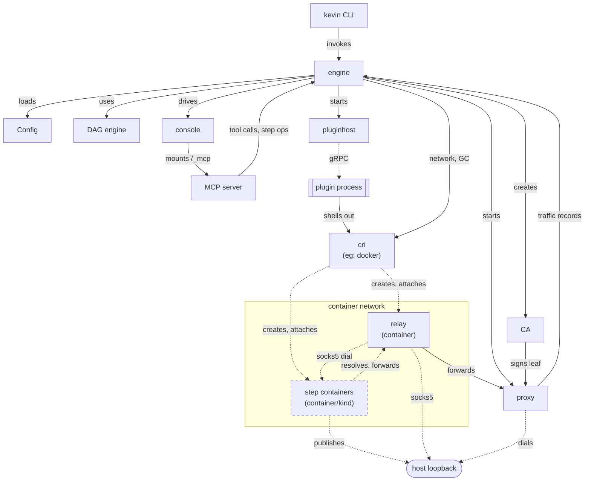

# Architecture

A map of kevin's parts and how they connect. Each part has its own page below with the reasoning behind its shape.

| Part          | Responsibility                                                |
|---------------|---------------------------------------------------------------|
| CLI           | Parses the command line.                                      |
| Engine        | Loads the environment, starts the plugins, walks the DAG.     |
| Configuration | Reads `kevin.cue`. Validates every step before anything runs. |
| DAG engine    | Orders the steps. Runs independent steps concurrently.        |
| Plugin host   | Starts a plugin process and keeps the process alive.          |
| Plugin SDK    | The public API that a plugin author implements.               |
| Wire contract | The gRPC service between the engine and a plugin.             |
| Proxy         | Terminates TLS, routes to a workload, controls egress.        |
| Console       | Shows the DAG state, the logs, and the proxy traffic.         |
| MCP server    | Exposes the running session to an MCP client over Streamable HTTP, mounted at `/_mcp` on the console's own listener. |
| CA            | Creates the CA and mints a leaf certificate for the proxy.    |
| Relay         | In-network DNS + TLS/HTTP forwarder for name resolution with no host changes, plus a SOCKS5 gateway a host process can dial to reach a step directly. |
