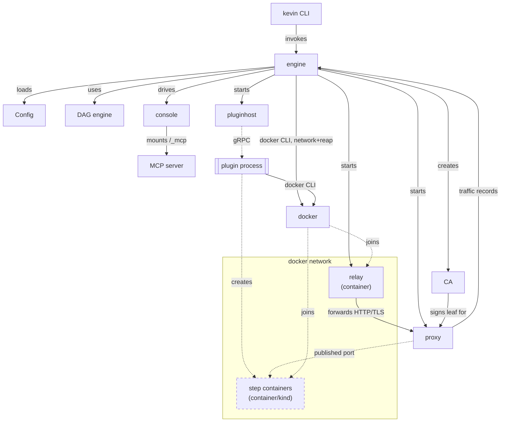

# Architecture

This document describes the parts of kevin and the reasons for the shape of each part.

## Components

| Part          | Package               | Responsibility                                                |
|---------------|-----------------------|---------------------------------------------------------------|
| CLI           | `internal/cmd`        | Parses the command line.                                      |
| Engine    | `internal/engine` | Loads the environment, starts the plugins, walks the DAG.     |
| Configuration | `internal/config`     | Reads `kevin.cue`. Validates every step before anything runs. |
| DAG engine    | `internal/dag`        | Orders the steps. Runs independent steps concurrently.        |
| Plugin host   | `internal/pluginhost` | Starts a plugin process and keeps the process alive.          |
| Plugin SDK    | `plugin`              | The public API that a plugin author implements.               |
| Wire contract | `protos/pb`           | The gRPC service between the engine and a plugin.         |
| Proxy         | `internal/proxy`      | Terminates TLS, routes to a workload, controls egress.        |
| Console       | `internal/console`    | Shows the DAG state, the logs, and the proxy traffic.         |
| MCP server    | `internal/mcpserver`  | Exposes the running session to an MCP client over Streamable HTTP, mounted at `/_mcp` on the console's own listener. |
| CA            | `internal/ca`         | Creates the CA and mints a leaf certificate for the proxy.    |
| Relay         | `internal/relay`, `cmd/kevin-relay` | In-network DNS + TLS/HTTP forwarder for name resolution with no host changes. |

## Environment file

A project directory holds a `kevin.cue` file. This file declares the plugin binaries and the steps. kevin unifies the file with a core schema in `internal/config/schema.cue`.

The environment file holds two independent DAGs, and each DAG is a scope.

| Scope   | Lifetime             | Commands                        |
|---------|----------------------|---------------------------------|
| `setup` | Pesists across runs. | `kevin setup`, `kevin teardown` |
| `env`   | Ephemeral.           | `kevin run`                     |

The two scopes use one engine and one protocol. An `env` step's `needs` may additionally name a `setup` step, prefixed `setup.` (`needs: ["setup.<name>"]`) - resolved through `Export`, not `Up`, since a plain `kevin run` never brings the setup scope up in that process. See [Cross-step values](#cross-step-values) below.

State for one project lives in a `.kevin/` folder, or `.kevin/<name>/` for a named environment selected with `-e`/`--env` (see [Environment file]()). Two projects, or two named environments in one project directory, can run at the same time, because kevin prefixes every resource with the project name.

### Provider model

A plugin is a provider. A provider offers one or more step types, and a step names one with `uses: "<plugin>:<step>"`. Both parts are required: the plugin that offers the step type, and the step type itself.

`builtin` is the provider that kevin supplies. It is never declared in a `plugins:` block. See [Reference]() for the step types it currently offers.

Nothing about the engine is specific to any one step type, builtin or third-party. A Kubernetes cluster, for instance, is a plugin like any other, not a special case: the first one uses [kind](), and a plugin for minikube or k3s would be a new binary needing no change to the engine.

A `plugins:` entry names a source, not a namespace. A source says how kevin obtains the plugin binary. `cmd`, `file`, `oci`, and `http` are the sources that kevin implements. `file` names a tar package (`internal/pluginpkg`): a manifest, the plugin binary, and any supporting files, extracted into the project workspace and launched exactly like a `cmd` source. `oci` names the same package, fetched from an OCI registry (`internal/ocipkg`) with multi-arch image-index resolution. `http` names the same package again, fetched over a plain URL (`internal/httppkg`) with an optional `checksum` pin, since a URL carries no built-in digest addressing the way an OCI reference does. `oci` and `http` share one global, content-addressed cache (`internal/pkgcache`, under `~/.kevin/pkg-cache/`). The same sha256-named blob downloaded by either source is available to the other, before both hand the cached local file to the same `pluginpkg.Extract`.

`file`, `oci`, and `http` also accept `signed`, which pins provenance instead of (or alongside) a `checksum`/digest pin: it requires a valid [minisign](https://jedisct1.github.io/minisign/) signature from a key in a local trust store (`internal/pkgtrust`, `~/.kevin/trusted-keys/`) before `pluginpkg.Extract` ever runs. Verification (`crypto/ed25519` plus BLAKE2b-512 prehashing via `golang.org/x/crypto/blake2b`, through [`github.com/jedisct1/go-minisign`](https://github.com/jedisct1/go-minisign), minisign's own author's reference Go implementation) is the only signing code kevin ships. Signing itself is always the external `minisign` CLI, applied to the archive `kevin plugin pack` built, so kevin's binary never holds or generates secret key material. The trust store lives outside `kevin.cue` deliberately: `checksum` and a plugin's declared `oci`/`http` reference already live in the same file a project author controls, so pinning trust there too would let anyone who can edit `kevin.cue` also choose what's trusted. `kevin plugin trust add/list/remove` manage the store; `kevin plugin push` uploads a package's sibling `.minisig` file automatically, via a cosign-style fallback tag (`<repo>:sha256-<digest>.sig`). The OCI client kevin uses (`cuelabs.dev/go/oci/ociregistry`) has no OCI 1.1 referrers-API support, so this reuses the same tag/manifest/blob calls the package itself already goes through, rather than a dedicated discovery mechanism.

A `plugins:` entry may carry a `config` block of its own. This block configures the provider, not one step. The provider validates it against its own config schema.

Fourteen namespaces are reserved:

`builtin`, `cmd`, `core`, `docker`, `file`, `helm`, `http`, `k8s`, `kevin`, `kubectl`, `kubernetes`, `oci`, `official`, `std`.

A `plugins:` key cannot declare one of them, so that no third-party plugin reads as first-party, and so that a namespace is never mistaken for a source.

Only a plugin that a step references starts. A `plugins:` entry that no step names declares no binary and starts nothing.

## Plugin protocol

Every step type speaks the same protocol over gRPC, six RPCs: `Info`, `Configure`, `Up`, `Down`, `Export`, `CallTool`. See [The plugin protocol]() for each one and the session-startup sequence that calls them.

Session startup's per-step `with`-block unification (step 4 of that sequence) is what `internal/config.BenchmarkValidate` (`go test ./internal/config/... -run ^$ -bench BenchmarkValidate`) measures as step count grows. At 1, 10, 100, and 1000 steps the cost scales linearly, not quadratically, on the measurements taken so far. Re-run it before any change to how a step's `with` block unifies.

### Cross-step values

A step publishes outputs. Every step that declares a `needs` edge on that step receives the outputs. A downstream step reads a value such as the endpoint of a registry, or the path of a kubeconfig file.

A step's own plugin code always gets every upstream output through the wire request. The engine passes it beside the `with` block, not through it. But a `with` value itself can also reference one, using `${cel-expression}`: any string in the `with` block, at any depth, that contains `${...}` gets that expression evaluated, against a `needs` variable shaped `map[string]map[string]map[string]string`, keyed by upstream step name, then by `out` (that step's own plugin-authored outputs) or `system` (values kevin computes itself, kept apart so a kevin-computed key can never collide with one a plugin chose for its own output). The same expression can also read `env.<VAR>`, the kevin process's own environment variables; referencing an unset one errors, so `has(env.VAR) ? env.VAR : "default"` is the idiom for an optional one. The result is spliced back into the surrounding text before the plugin ever sees it. A step whose `with` block never uses `${` pays no cost; there is no other change to what the plugin receives.

`internal/expr` implements this, using [CEL](https://github.com/google/cel-go). `internal/engine`'s DAG walk calls it once per step, right where the upstream outputs for that step are already assembled, so this needs no separate resolution phase and no reordering of validate-then-walk: CUE unification of the `with` block still happens once, globally, before the walk starts, and only ever sees the `${...}` placeholder as a plain string. The mechanism itself is generic: any step type's `with` block can use it, builtin or third-party. See [CEL expressions]() for the full syntax reference.

#### Crossing scopes with `needs`

An `env` step's `needs` may name a `setup` step, one-way only - never the reverse, since `setup` is provisioned independently of any `env` run. The entry carries a literal `setup.` prefix, e.g. `needs: ["setup.cluster"]`: a bare name always means same-scope, so there is never a fallback search into the other scope and never any ambiguity if the same name happens to exist in both.

Because a plain `kevin run` never brings the setup scope up in that process, this dependency can't be satisfied by walking the DAG the way a same-scope one is. It's resolved by calling the setup step's plugin `Export` RPC instead - the setup step's plugin is already running (`LoadAndLaunch` starts every plugin either scope references, regardless of which one is executing), so no extra process launch is needed, and `Export` is specced as a cheap, side-effect-free, always-live query, so kevin calls it fresh every time a dependent step runs rather than caching it.

Reading the resolved value back uses a separate top-level `setup` CEL variable, not a nested `needs.setup...` path: `${setup.<name>.out.<key>}`. This is deliberate, not cosmetic - `needs`'s CEL type is a uniform three-level map (step name → `out`/`system` → key), and a cross-scope reference needs one more level (the setup step's own name) that can't coexist with that uniform shape in the same variable without losing static typing. A sibling `setup` variable, with the exact same type as `needs`, sidesteps that entirely and, as a side effect, means a same-scope step literally named `setup` stays reachable at the ordinary `needs.setup.out.x` with zero ambiguity against the new `setup.<name>.out.x`.

`Export`'s `out` field uses the same `Value` type `Up`'s outputs do, so a plugin can mark an exported value `Sensitive` - a generated password from a `setup` step, say - and it keeps that flag over the wire `Deps` field of the step that named it in `needs`, the same as a same-scope `Sensitive` output would. CEL rendering itself still discards sensitivity either way (a value substituted into a rendered `with` string has no way to carry a flag); the wire `Deps` field is what preserves it end to end.

### Crash recovery

Any `Up`/`Down` RPC failure fails that step, the same whether the plugin returned an ordinary error or the process crashed out from under the call. The engine removes whatever came up (`dag.Graph.Walk` keeps an accurate record of every step that finished before the failure, so `Down` still runs for those), followed by a docker-label reap sweep, same as any other step failure.

A crash specifically surfaces as `pluginhost.ErrCrashed` in the error chain (a `codes.Unavailable` gRPC transport error, the same heuristic other go-plugin consumers such as Terraform use to recognize a dead process) rather than an opaque wrapped transport error, so the failure is recognizable for what it is.

There's no restart-in-place: kevin doesn't try to relaunch the crashed plugin process and resume the walk mid-flight. The actual recovery path is re-running `kevin run`. Every builtin step's `Up` is idempotent on its deterministic `project`+`step` name - some delete then create, others are apply-style by construction (see [Docker](#docker)) - specifically so that a fresh run safely picks up wherever a crashed one left off, without kevin needing any state file or restart machinery to make that safe.

## DAG engine

`internal/dag` holds a map of step names to dependency names. `Validate` finds unknown dependencies and cycles.

`Walk` runs one goroutine for each step. A goroutine waits on the done channel of each dependency, then runs the step. The first step that fails cancels the context of the other steps.

`Walk` skips a step when a dependency of that step fails. `Walk` does not report the skip as a failure. Thus the returned error is the root cause and not a cascade of secondary errors.

`Walk` returns the outputs of every completed step. The engine uses the result to remove exactly the steps that came up.

`Reverse` inverts every edge. Removal uses the same scheduler, thus removal is also parallel where the graph permits.

## Proxy

kevin changes no file on the host. There is no entry in `/etc/hosts`, no file in `/etc/resolver`, and no DNS server for the host.

A client reaches the environment through the proxy. The client sets `HTTP_PROXY` and `HTTPS_PROXY`, or loads `http://<proxy>/proxy.pac`. The `CONNECT` handler of the proxy resolves a hostname against the internal registry of the engine. A step fills the registry when `Up` returns a `Route`.

The environment has a base domain, `kevin.home` by default. A `route` step puts a name on it. See [Subdomain routing](#subdomain-routing) below for the general mechanism, which works the same whether the address behind the name is a container's published port or something behind a relay. A bare step name is not a route, because a name without a dot could shadow a real host.

The proxy serves a proxy auto-config file at `/proxy.pac`. The file matches the base domain on a suffix, thus a step added later needs no reload. It sends everything else direct, so normal browsing is untouched. The file names the proxy by the host that the browser asked for, which keeps a loopback address and a LAN address both working.

`NO_PROXY` lists the step names, so a workload that honors it reaches another workload straight over the docker network. Not every client honors it. Busybox `wget` ignores `NO_PROXY`, thus a step must also be reachable through the proxy under its full name.

One listener serves three roles.

1. A forward proxy that terminates TLS. The proxy mints a leaf certificate for the requested host, and signs the certificate with the kevin CA.
2. A reverse proxy. The proxy matches the Host header against the routing table and forwards to the workload.
3. An egress control. The proxy denies a host that no route covers and that no allow list covers.

Egress denies by default. `proxy: egress: deny: false` in `kevin.cue` disables the control. Every request then reaches the internet, as before milestone 7.

An allow entry is an exact host, such as `api.github.com`, or a leading-dot wildcard, such as `*.github.com`. A wildcard matches a subdomain. It does not match the bare domain: `*.github.com` matches `api.github.com`, not `github.com`. List the bare domain too when both must reach the internet. Matching ignores case and ignores any port. `proxy: egress: allow` in `kevin.cue` names hosts for the whole environment. A step names hosts for itself alone, through the `egress_allow` field of its `Up` result. A route that a step registers always reaches the proxy. A workload of the environment is not egress.

A denied request still completes TLS. The CONNECT handler MITMs every host, denied or not. The proxy answers a denied request with `403 Forbidden` instead of closing the connection. The page names the denied host. It shows the exact CUE to add, for the whole environment and for one step. The response carries `Cache-Control: no-store`, `Pragma: no-cache`, and `Expires: 0`. A browser must not serve a cached denial after the user fixes the allow list.

Containers on the docker network reach each other by container name through the embedded DNS of Docker. That path needs no change on the host.

`internal/proxy` owns `CONNECT`, the MITM, and the leaf signing itself, no third-party proxy library. A `CONNECT` hijacks the underlying connection, writes `200 Connection Established`, then hand-shakes TLS with a leaf `internal/proxy` mints on the fly (`certs.go`, signed by the project's intermediate authority) and offers both `h2` and `http/1.1` over ALPN. The negotiated protocol decides how the decrypted traffic is served: `h2` goes to `golang.org/x/net/http2`'s `Server.ServeConn`; `http/1.1` (or no ALPN at all) is handed to a plain `net/http.Server.Serve` over a one-connection listener, so keep-alive and chunked encoding stay stdlib rather than hand-rolled. Either way the decrypted request reaches the same routing/egress-deny logic (`mitm.go`, `proxy.go`) a plain forward-proxy request already goes through. A minted leaf carries whatever Subject kevin chooses, no fixed organization string imposed by a library.

A WebSocket upgrade gets its own explicit path (`websocket.go`), not a free ride from `net/http/httputil.ReverseProxy`: the handshake is an ordinary HTTP request, so Host routing and the egress-deny check both apply to it exactly as they would to any other request, and it gets one entry in the traffic log for the handshake itself. Only the frame stream after a successful upgrade is an unrouted, unlogged raw pipe (kevin hijacks the connection and copies bytes bidirectionally once it sees a `101` with `Upgrade` in the response). This is the same shape of gap `expose` already exists to name honestly for non-HTTP traffic in general, rather than something WebSocket-specific.

### Host-bound

The proxy runs in the engine process, not in a container. It therefore cannot resolve a network alias, and on macOS it cannot reach a container address either. A route must name an address that the host can reach.

The container plugin publishes the port of a step on the loopback when the step declares a `host`, and returns that published address as the upstream. A step reaches another step by step name, and the proxy reaches a step by its published port.

A step that serves a name is ready when its published port accepts a connection, not when the container starts. A started container reports `Running` before the process inside binds its port.

## Console

`internal/console` renders with templ and updates with htmx over SSE. Both scripts ship in the binary through `go:embed`, thus the console needs no network.

The page renders the state that the server holds, then opens **one** stream. Every later change arrives on that stream as a fragment that names its own target: a step row replaces itself with `hx-swap-oob`, and a log line or a request row arrives inside an `hx-partial` that names the region and the swap.

htmx 4 removed `sse-swap`. An unnamed message swaps into the element that opened the connection, and a named event dispatches a DOM event instead. One connection carrying out of band fragments therefore replaces the per-element subscriptions of htmx 2.

A client receives a full repaint as soon as it connects. htmx reconnects on its own after a drop, and without the repaint a browser would hold stale rows until the next change, which may never come.

The server never blocks on a browser. Each client has a bounded buffer, and a client that falls behind is dropped and reconnects.

## MCP server

`internal/mcpserver` gives a coding agent the same read/control surface the console gives a human, over [MCP](https://modelcontextprotocol.io)'s Streamable HTTP transport instead of SSE/htmx: `list_steps`, `get_step`, `rerun_step`, `export_step`, and `get_proxy_info`.

It mounts at `/_mcp` on the same `net/http.ServeMux` the console registers its own routes on (`console.Server.RegisterRoutes`), rather than binding a listener of its own. A fourth loopback port for one more agent-facing surface would be one more thing to print, route through a firewall exception, and explain - the console already owns exactly the state an MCP tool call needs (`console.Server.View()` for `list_steps`/`get_step`, the registered rerun handler for `rerun_step`) and already binds one HTTP server for exactly this session's lifetime, so the MCP server rides on it instead of duplicating the bind/listen/shutdown dance `startConsole` already does.

`get_proxy_info` reads `proxy.Proxy.Routes()` and `proxy.Proxy.EgressAllowList()` directly, and `export_step` calls a step's plugin `Export` RPC through the session's already-running `pluginhost.Client` - the same RPC `kevin connect` makes, but against the live session instead of a freshly relaunched one, since an MCP client is asking about an environment that's already up. The console's own **MCP** tab shows the URL and the `claude mcp add` command to register it, the same page that shows the proxy's PAC URL and export line.

A plugin can contribute its own tools alongside these five, through the `CallTool` RPC. See [The plugin protocol]() for the wire method and [Writing a plugin]() for `ToolProvider`.

## CA

`internal/ca` creates the authorities and holds the private keys. The proxy needs a private key to sign a leaf, thus the authority does not live in a plugin. Every key is ECDSA P-256, at mode 0600 in a directory at mode 0700.

There are two levels.

| Level | Location | Subject | Signs |
| --- | --- | --- | --- |
| Root | `~/.kevin/` | `Kevin Local Root CA` | the authority of a project |
| Project | `./.kevin/` (`./.kevin/<name>/` for a named environment) | `Kevin Local Intermediate CA - Project <name>` | a leaf for each host |

Only the root reaches a trust store, and it reaches it one time for the machine. A trust store therefore holds one kevin anchor however many projects exist. Each project signs with its own key, which lives in the project directory and goes when the directory goes.

The certificate file of a project holds the chain: the authority of the project, then the root. `internal/proxy` appends this same chain after every leaf it mints, thus a client that trusts the root alone can build the chain.

`LoadOrGenerateIntermediate` checks the signature of the authority of the project against the root. A user who deletes the home directory gets a new root, and the stale authority of the project is replaced rather than served.

`kevin ca install`/`uninstall` manage the trust store directly, outside the DAG entirely - the root names no project, so there's no per-project `setup`/`teardown` scope for it to live in. `internal/trust` installs the root certificate into the keychain of macOS, the anchor directory of Linux, and the NSS database of each Firefox profile.

A store that this machine does not have is a skip, not a failure. A machine without `certutil` reports that Firefox will not trust the authority, and the command continues.

The default is the trust store of the **user**, which needs no root. macOS still asks the user to confirm the change to the trust settings. `--system` writes the machine-wide store, which needs root. `kevin ca install` never asks for a password itself: it reports the exact command, and the user runs it.

There is no state file, thus `kevin ca uninstall` must be idempotent and must derive what it removes from the trust stores themselves. It matches on `ca.RootCommonName`, a constant - not a per-project subject the way a DAG step's `Down` would need to derive from the environment - so a second call is naturally a no-op rather than a duplicate-removal error.

## Docker

kevin runs the `docker` command and parses the JSON output. kevin does not import the Docker SDK.

The reason is the size of the dependency. `github.com/docker/docker` pulls in a large tree for a small number of calls. The cost of the choice is the parse of the command output, and a runtime dependency on the `docker` binary.

Every container carries three labels at increasing granularity - a materialized path, each value holding every segment up to its own tier: `kevin.project` (`"<project>"`), `kevin.scope` (`"<project>:<scope>"`), and `kevin.urn` (`"<project>:<scope>:<step>"`). Docker's label filter is exact-match only, with no prefix or wildcard, so each tier is its own label: `kevin.project` finds every resource of a project in one query, `kevin.scope` finds every resource of one scope in one query, without a "setup" step and an "env" step of the same name being confused for each other. The engine lists the containers of the project after it removes the steps, and deletes whatever is left - except a container whose `kevin.scope` names the other scope and is still live, since setup and env share one project network. There is no state file: a label survives a crash, and a file can go stale.

The engine creates the shared network before the DAG runs and removes it after. A container joins that network with a network alias equal to the step name, thus one step reaches another by step name.

## Relay

The relay is a container on the shared docker network. It answers DNS queries for the environment domain with its own address. It forwards HTTP and TLS traffic to the proxy on the host.

The relay carries no routing table and no egress policy. The proxy remains the single place that holds both. A workload that resolves a step through the relay still reaches the proxy, and the proxy routes the request by the Host header, the same as it routes every other request.

### Lifecycle

The relay container's name is deterministic (`kevin-<project>-relay`), and `Start` reuses one already running rather than recreating it - a persisted `setup`-scope resource (a `kind` cluster's CoreDNS patch, say) that baked in the relay's address at `Up` time needs that address to survive the process that created it exiting. `kevin setup` leaves its relay running; `kevin run` afterward reuses it; `kevin teardown` is what finally removes it, once neither scope still needs it.

A reused container must still forward to a live proxy, and the proxy's gateway listener binds an OS-assigned port fresh each process by default - so `Start` compares the running container's recorded domain/proxy address against what this process would use, and replaces it on a mismatch rather than reusing a relay that would silently forward nowhere. The gateway listener tries the port a previous process in the same workspace recorded first, which keeps that address (and therefore the relay) stable across most process boundaries; the replace-on-mismatch path only fires when that port could not be reused, or the domain changed.

### Pod routing

The kind plugin patches the CoreDNS Corefile of the cluster after the nodes join the shared network. The patch adds a forward zone for the environment domain that points at the relay. The plugin restarts CoreDNS to load the change.

A pod then resolves `<step>.<domain>` through the cluster DNS. The pod needs no proxy environment variable of its own.

A pod reaches a step across two hops on the host. The pod resolves the name through CoreDNS and connects to the relay over the docker network. The relay forwards the connection to the proxy on the host. The proxy then connects to the published port of the step, on the host again.

### Gateway bind

The proxy binds a second listener on the gateway address of the shared network. A container reaches the proxy there directly. `proxy.gateway_port` in `kevin.cue` pins that listener's port instead of the default persist-and-reuse behavior described above.

Docker Desktop on macOS and on Windows runs the daemon inside a virtual machine. The gateway address exists only inside that machine. A bind from the host fails with `EADDRNOTAVAIL`. The relay then reaches the proxy through `host.docker.internal` instead.

Plain Linux Docker runs the daemon on the host. The gateway bind succeeds there, and the relay uses that listener.

### Cluster tunnel

The relay's other job runs the opposite direction: `kevin-relay` also has a `-socks5-listen` mode, mutually exclusive with `-domain`/`-proxy`, that runs a SOCKS5 server instead of the DNS/HTTP forwarder. A `builtin:kind` step's `with.expose` list stands up exactly one such relay as a Pod inside the cluster, so a client outside the cluster can dial an arbitrary in-cluster address (a Service DNS name or a Pod IP, with its port) by asking the relay to `CONNECT` to it.

This exists because a kind cluster's `extraPortMappings` are fixed at cluster creation, before `Up` has created anything, unlike a container step's port publish. One relay avoids needing a static port mapping per exposed service: `Up` picks one host port, bakes one `extraPortMappings` entry for it into the generated cluster config (pointed at the control-plane node), loads the `kevin-relay` image into that same node with `nodeutils.LoadImageArchive`, and applies the relay Pod with `kubectl apply` run inside the node, the same `docker exec`-wrapped `kubectl` mechanism the CoreDNS patch already uses, pinned to the same node `nodeutils.BootstrapControlPlaneNode` finds.

A `builtin:kind` step's `Up` does not wait for an `expose` entry's address to become dialable, unlike a container step's `expose` waiting on its own port. kind doesn't own what an entry names. The target is usually deployed separately, by a manifest applied after the cluster is up, so `Up` only wires the relay and reports the address. `Result.ExposedPorts` itself never reaches a dependent step's wire request, so the engine mirrors each entry's relay address into the `needs` variable's `system` sub-namespace, as `needs.<step>.system.expose_<name>`, kept separate from `out` (a step's own `Outputs`) specifically so a kevin-computed key can never collide with one a plugin chose for its own output (see [Cross-step values]()). This mirroring is generic engine behavior, not kind-specific; it runs for any plugin's `ExposedPorts`. A `builtin:wait` step's `tcp` check reads `needs.<step>.system.expose_<name>` to close the readiness gap generically, dialing through the relay the same way a [`kubectl` or `helm`]() step applies a manifest into the same cluster.

An `expose` entry reports through the same `Result.ExposedPorts` a container step's `expose` already populates. No protocol or console change was needed. A plain `host:port` isn't enough information here, since a client must dial the relay and then ask it to reach the real target, so `Upstream` carries both as one string: `socks5://127.0.0.1:<relayPort>/<address>`, and `Protocol` reads `"socks5"` rather than `"tcp"`/`"udp"`, marking that it needs a SOCKS5-aware dial rather than a direct one.

The engine doesn't make a client do that dial itself. For any step's `ExposedPort` with `Protocol == "socks5"` (not kind-specific, any plugin's), it opens one more loopback listener of its own and forwards every accepted connection through a SOCKS5 dial to the target. A plain client like `psql` just connects to that local port with no SOCKS5 awareness at all. The address is mirrored into `system` too, as `needs.<step>.system.forward_<name>`, alongside the raw `expose_<name>` entry, and shown in the console as its own row next to the `socks5://...` one.

### Subdomain routing

`builtin:route` is the one mechanism for putting a step on the environment domain: `container`, `kind`, or a third-party plugin, any of them, through the exact same `with.routes` list. An entry either names an address the proxy process can dial directly (a `container` step's published loopback address, read from its `Outputs`), or, when the step sets `relay`, a target reached by tunneling through a relay, typically a Kubernetes Service inside a `kind` cluster.

The relay-tunneled half reuses `expose`'s existing mechanism. `expose` reaches into a cluster for a raw TCP client. It never goes through the proxy, and it has no concept of a hostname. `builtin:route` reuses the exact same relay Pod and the same `Upstream` convention `expose` already established, a `socks5://` URL whose path carries the real target, but for `Route` instead of `ExposedPort`: it needs nothing new from the wire protocol or the plugin SDK, only a small addition to the proxy itself, since a route's `Upstream` must be something *the proxy process* can dial, and a relay-tunneled target plainly isn't.

`internal/proxy` gives its `ReverseProxy` a real `Transport` (previously left nil, defaulting to `http.DefaultTransport`) whose `DialContext` reads one piece of request-scoped context: when `forward` matches a `Route` whose `Upstream` parses as that `socks5://` shape, it rewrites `r.URL.Host` to the relay's own address (a real, loopback-published address, dialable exactly like any other route's upstream) and stashes the real target on the request's context. The dial function then dials the relay and issues a SOCKS5 `CONNECT` for that target, instead of treating the relay's own address as the destination. This is the same handshake `newPortForward` already performs for a `socks5`-protocol `ExposedPort`, just one layer further down, inside the proxy's own outbound dial rather than an engine-managed local listener. A WebSocket upgrade (`serveUpgrade`, which bypasses `ReverseProxy` for its own raw dial) goes through the identical `dialContext` method, so it inherits the same relay-awareness for free.

`builtin:route` itself does no Kubernetes work at all. It isn't `kind`-specific, only convention-compatible with it. It takes a relay address and a list of host/address pairs, and returns one `Route` per pair with `Upstream` built in that same `socks5://` shape. Because `kind`'s relay Pod deploys only when `expose` is non-empty, `kind` gained a `relay: bool` field to opt in to the Pod with no `expose` entries, and publishes the relay's address as a `relay_addr` output for a downstream `route` step to read, keeping `kind` itself decoupled from whatever `kubectl`/`helm` step actually deploys the routed service. DAG ordering (`route`'s `needs` naming both the cluster and the deploying step) is what makes the target address meaningful by the time `route`'s `Up` runs.

### Limits

The relay resolves a name. It does not control egress. A workload that resolves an external name through the relay gets the real address of that name, and connects to the internet directly.

Egress control still needs the proxy environment variables on a workload. A step still needs the allow list to reach an external host.

Published ports remain necessary. The host proxy reaches a workload through the loopback address that the container plugin publishes. The proxy runs on the host and cannot resolve a network alias.

