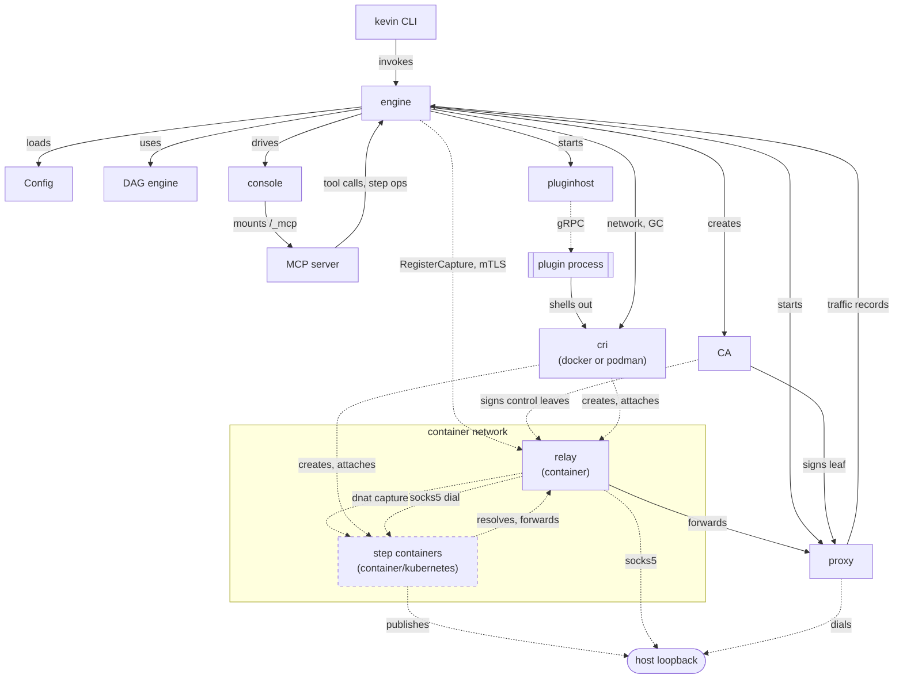

# Architecture

The parts of kevin and how they connect. The other pages in this section explain each part.

```mermaid
graph TD
    CLI["kevin CLI"]
    ENG[engine]
    CFG["Config"]
    DAG["DAG engine"]
    HOST[pluginhost]
    CON[console]
    CA["CA"]
    MCPN[MCP server]
    PLUG[["plugin process"]]
    CRI["cri<br/>(docker or podman)"]
    PROXY[proxy]
    LOOP(["host loopback"])

    subgraph DOCKERNET["container network"]
        RELAY["relay<br/>(container)"]
        STEPC["step containers<br/>(container/kubernetes)"]
    end

    CLI -->|invokes| ENG
    ENG -->|loads| CFG
    ENG -->|uses| DAG
    ENG -->|starts| HOST
    ENG -->|drives| CON
    ENG -->|creates| CA
    CON -->|mounts /_mcp| MCPN
    MCPN -->|tool calls, step ops| ENG
    HOST -.gRPC.-> PLUG
    PLUG -->|shells out| CRI
    ENG -->|network, GC| CRI
    STEPC -.->|publishes| LOOP
    STEPC -.->|resolves, forwards| RELAY
    RELAY -.->|dnat capture| STEPC
    RELAY -.->|socks5| LOOP
    PROXY -.->|dials| LOOP
    RELAY -->|forwards| PROXY
    ENG -->|starts| PROXY
    ENG -.->|RegisterCapture, mTLS| RELAY
    CA -->|signs leaf| PROXY
    CA -.->|signs control leaves| RELAY
    CRI -.->|creates, attaches| RELAY
    CRI -.->|creates, attaches| STEPC
    RELAY -.->|socks5 dial| STEPC
    PROXY -->|traffic records| ENG

    classDef dashedNode stroke-dasharray: 5 5
    class STEPC dashedNode
```

| Part          | Responsibility                                                |
|---------------|---------------------------------------------------------------|
| CLI           | Parses the command line.                                      |
| Engine        | Loads the environment, starts the plugins, walks the DAG.     |
| Configuration | Reads `kevin.cue`. Validates every step before anything runs. |
| DAG engine    | Orders the steps. Runs independent steps concurrently, capped by `engine.max_parallel`. |
| cri           | Runs the `docker` or `podman` command.                         |
| Plugin host   | Starts the plugin processes and keeps them running.            |
| Plugin SDK    | The public API that a plugin author implements.               |
| Wire contract | The gRPC service between the engine and a plugin.             |
| Proxy         | Terminates TLS, routes to a workload, controls egress.        |
| Console       | Shows the DAG state, the logs, and the proxy traffic.         |
| MCP server    | Gives an MCP client, such as a coding agent, access to the running environment, at `/_mcp` on the console address. |
| CA            | Creates the CA and signs certificates for the proxy and relay. |
| Relay         | A container on the project network. Answers DNS for the environment domain, sends container traffic to the proxy, and lets the host reach ports inside the network. |
